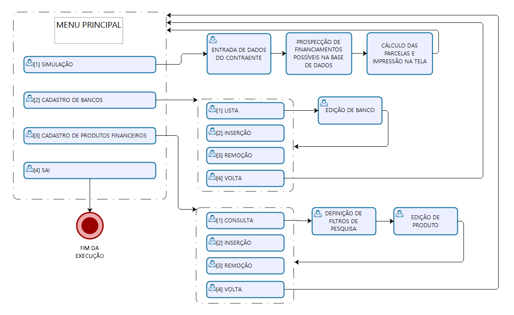

# Trabalho LPG-1

## Requisitos
Faça seu próprio sistema de controle de dados que resolva algum problema real, empresarial ou pessoal.

Cronograma:

* [x] Definição da Equipe (duplas): até dia 20/05 (confirme a equipe até este dia usando o e-mail rafaelberri@gmail.com e no assunto informe “LPG – TF Equipe”).
* [x] Definição do problema a ser tratado: até dia 27/05. Envie um texto descrevendo o problema que o sistema final poderia ajudar. Envie a definição principal dos dados (structs) que será utilizado na solução escolhida. No mínimo, o programa deverá trabalhar com 10 campos. (Envie até este dia usando o e-mail rafaelberri@gmail.com e o assunto “LPG – TF Dados”).
* [ ] Apresentação do sistema será dia 17/06. Todos os integrantes deverão falar. Deverá ser apresentado o sistema/problema. Duração máxima de cada apresentação serão 12 minutos e 3 minutos para perguntas. A equipe deverá se atentar em mostrar, principalmente, os pontos de avaliação abaixo.
* [ ] Envio do código fonte (17/06). Enviar para rafaelberri@gmail.com um arquivo compactado contendo o código fonte do programa, a apresentação final, e um texto descritivo do sistema/problema atendido (com no máximo 2 páginas de texto).

## Critérios de Pontuação
|Descrição|Peso|
|-|-|
|Definição da estrutura de dados|1,0|
|Operação de cadastro/inserção de dados (validação da entrada de dados)|1,0|
|Operação de consulta de dados (possibilitar a consulta utilizando, pelo menos, dois campos)|1,0|
|Operação de exclusão de dados (deixe claro a estratégia adotada)|1,0|
|Inovação (utilização de técnicas, bibliotecas e soluções não trabalhadas na disciplina)|2,0|
|Telas do programa (boa aparência e praticidade)|1,0|
|Texto descritivo|1,0|
|Apresentação e organização|1,0|
|Presença (durante o mês de junho e principalmente na apresentação final)|1,0|

## Cadastro de Bancos com seus Produtos Financeiros para Simulação de Financiamento

### Introdução
O sistema permite o cadastro, a consulta e a remoção de dados de instituições financeiras com suas respectivas condições para financiamento. De posse de tais dados, o sistema permitirá que um usuário efetue a prospecção de financiamentos compatíveis com o perfil que ele definir, apresentando na tela os valores para cada financiamento.

### Dados para Cadastro
O cadastro de instituições financeiras requer as seguintes estruturas de dados:
``` C
#define MAXNOME 100

struct Banco {
    int idBanco; // identificador da instituição financeira
    int disponivel; // flag indicando se a instituição financeira está disponível ou não
    char nome[MAXNOME]; // nome da instituição financeira
};

struct Produto {
    int idProduto; // identificador do produto
    int disponivel; // flag indicando se o produto está disponível ou não
    int idBanco; // identificador da instituição financeira à qual o produto pertence (chave externa)
    char nome[MAXNOME]; // nome do produto
    int sistAmortizacao; // indica o sistema de amortização que pode ser SAC (0) ou PRICE (!=0)
    float maxPorcentFinanc; // número entre 0 e 1 indicando a máxima porção financiável do preço total
    float taxaEfetivaJuros; // número entre 0 e 1 indicando a taxa efetiva de juros
    int prazoMax; // número inteiro indicando a máxima quantidade de meses permitida para o financiamento
    float maxPorcentRenda; // número entre 0 e 1 indicando o máximo comprometimento da renda permitido
};
```

### Dados para a Propecção e Simulação
A prospecção e simulação de financiamentos requerem os seguintes dados do contraente:
* Renda -- ```float```
* Valor total do bem a ser adquirido -- ```float```
* Valor disponível para entrada -- ```float```
* Prazo total do financiamento em meses -- ```int```

O sistema retorna as opções disponíveis de acordo com a base de dados, ou uma mensagem indicando que não há opções de financiamento para os valores fornecidos. 

### Convenção para Nomes
Os nomes de entidades no código fonte seguem o seguinte padrão:

|Tipo|Formato|Exemplo|
|-|-|-|
|constantes|upper case|MAX|
|campos e variáveis|camel case|idProduto|
|structs e funções -- exceto ```main()```|pascal case|ByPassModel|
|bibliotecas e arquivos de apoio -- exceto ```README.md```|lower case|mathfunctions|

### Exclusão de Dados
A remoção de registros de bancos e de produtos se dará através do zeramento do campo ```disponivel```. Ao efetuar a inserção de um novo registro, o sistema deverá primeiro procurar por um registro com ```disponivel == 0``` e sobrescrever nele o novo registro. Somente será adicionado um novo registro ao fim do arquivo nos casos em que não houver registros com ```disponivel == 0```. Isto limitará a geração de lixo e o desperdício de recursos.

Para que os identificadores sejam unívocos, seus valores virão de um contador do tipo ```int``` gravado no início do arquivo, que é lido e incrementado a cada inserção de registro. Este método impede que um identificador de um registro, mesmo removido, seja reutilizado, além de conferir ao identificador a informação sobre a ordem de inserção.

Os registros com o campo ```disponivel``` zerado serão inacessíveis ao usuário seja para consulta ou para edição.

### Expectativa
O sistema não se limitará à curadoria de dados, mas também será capaz de converter os dados armazenados em informação útil, auxiliando pessoas na tomada de decisões.

### Conceitos e Técnicas que Não Foram Estudados na Disciplina
1. Associação de estruturas de dados através de chave externa.
2. Atribuição dentro de cláusulas condicionais.
3. Uso do valor de retorno da função ```fopen()``` no modo ```r``` para verificação da existência do arquivo.
4. Uso do valor de retorno da função ```scanf()``` para a validação da entrada de dados do usuário.
5. Alternativa multiplataforma a ```fflush(stdin)``` para consumir o retorno de linha em excesso no buffer de entrada.
6. Formatação de strings e números com ponto flutuante na função ```printf()```.
7. Utilização das bibliotecas ```locale.h``` e ```math.h```.
8. Conversão (*cast*) do dividendo de tipo ```int``` para ```float``` no cálculo do quociente tipo ```float```.
9. Uso do operador condicional ou ternário.
10. Uso de operadores de atribuição.
11. Funções variádicas e respectivas macros da biblioteca ```stdarg.h```.

### Ferramentas Utilizadas
* Visual Studio Code e CodeBlocks para a edição do código.
* GNU GCC e Microsot Visual C++ para a compilação do código.

### Funções Importantes
#### 1. ```int ConsultaProdutos(int modo, int id, int filtroBanco, int filtroSistemaAmort)```
Esta função variádica imprime os dados de uma consulta na tela e pode receber 2 ou 4 argumentos. Ela retorna um ```int``` com o número de resultados gerados pela consulta. ```ConsultaProdutos()``` não deve ser chamada com 3 argumentos, pois completará o quarto com lixo de memória.

##### Parâmetros:
|Nome|Descrição|Mandatório|
|-|-|-|
|```modo```|Define o modo de impressão dos resultados da consulta -- valor negativo: sem impressão; ```0```: lista simples; ```1```: impressão detalhada.| SIM |
|```id```|Recebe ```0``` para consultar mais de um registro e obrigar a passagem dos dois argumentos seguintes, ou o ID de um produto para consultar um registro único, eliminando a necessidade dos próximos dois argumentos.| SIM |
|```filtroBanco```|ID do banco ou ```0``` para não filtrar por banco.| NÃO |
|```filtroSistemaAmort```|Recebe ```1``` para filtrar por sistema SAC, ```2``` para filtrar por sistema PRICE, ou ```0``` para não filtrar por sistema de amortização.| NÃO |

#### 2. ```int Prospecta(float renda, float valor, float entrada, int prazo)```
Esta função é responsável por fazer a seleção na base de produtos de acordo com os dados fornecidos pelo prospectivo contraente, calculando os valores das parcelas e agrupando os dados dos financiamentos que se encaixam no perfil do contraente no endereço do ponteiro global do tipo ```struct Financiamento```, chamado ```poolFin```. A função retorna um  ```int``` com o número de financiamentos agrupados.

``` C
struct Financiamento {
    int idProduto;
    int idBanco;
    int sistAmortizacao;
    float taxaNominalAnual; // taxa de juros nominal ao ano com capitalização mensal = taxaEfetivaJuros*12
    int prazo; // prazo para o financiamento estipulado pelo cliente
    float primeiraParcela; // simulação da primeira parcela
    float ultimaParcela; // simulação da última parcela
};
```

A função chamadora (*caller*) da função ```Prospecta()``` (*callee*) fica responsável por liberar o espaço de memómia alocado pela última para o ponteiro global ```poolFin```, executando ```free(poolFin)``` após utilizar os seus dados.

## Proposta de Roteiro de Apresentação
### 1. Objetivo do Projeto
Discorrer sobre a expectativa do projeto como descrita acima.

### 2. Mapa dos Menus e Funcionalidades
Mostrar um esquema gráfico e explicar os caminhos de menu.



### 3. Demonstração Prática da Aplicação
Demonstrar as funcionalidades primeiro sem nenhuma base de dados, e depois utilizando uma base pré-elaborada para a demonstração de simulações de financiamento. Focar nas inovações e na regra de exclusão de registros.
